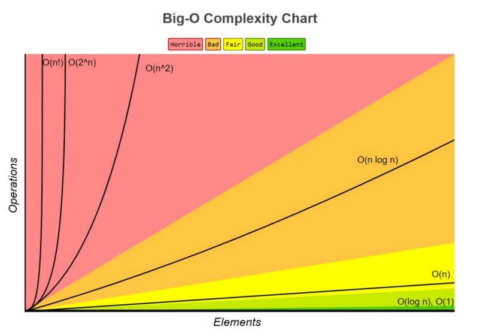

# Eficiência de algoritmos

## Como medir a eficiência e performance de um algoritmo?

Para isso Podemos utilizar como base a notação Big O (Big O Notation) que é utilizada para classificar a complexidade dos algoritmos, onde podemos fazer `análises assintóticas` para classificar o "custo" de processamento daquele algorítmo.

### Big O Notation



#### Alguns das principais notações:

## O(1) (Constante)

Não há crescimendo do número de operações, pois não depende do volume de dados de entrada **(n)**

_exemplo:_

```js
let arr = [1, 2, 3, 4, 5];
arr[2]; // => 3
```

## O(log n) (Logarítimo)

O crescimendo do número de operações é menor do que o do número de itens

_exemplo:_

- binary search

## O(n) (Linear)

O crescimendo no número de operações é diretamente proporcional ao crescimento de itens

_exemplo:_

```js
let arr = ["orange", "apple", "banana", "lemon"];

for (var i = 0; i < arr.length; i++) {
  console.log(array[i]);
}
```

## O(n log n) (linearitmica ou quasilinear)

é resultados das operações **(log n)** executada **n** vezes

_exemplos:_

- Merge sort
- Heap sort
- Quick sort

## O(n²) (quadrático)

Ocorre quando os itens de dados são processados aos pares, muitas vezes com repetições aninhadas

_exemplo:_

```js
const fruitArrays = [
  ["Apple", "Banana", "Cherry"],
  ["Orange", "Grape", "Kiwi"],
  ["Strawberry", "Blueberry", "Pineapple"],
];

for (let i = 0; i < fruitArrays.length; i++) {
  for (let j = 0; j < fruitArrays.length; j++) {
    console.log(fruitArrays[i][j]);
  }
}
```

## O(2^n) (exponencial)

À medida que **N** aumenta, o fator analisado (tempo ou espaço) aumenta exponencialmente

_exemplo:_

- torre de hanoi

### Extra

Para Facilitar a fixação das notações acima, podemos consultar a tabela abaixo (haha)

| Big O      | Alternativa |
| ---------- | ----------- |
| O(1)       | O(yeah)     |
| O(log n)   | O(nice)     |
| O(n)       | O(ok)       |
| O(n log n) | O(uch)      |
| O(n²)      | O(my)       |
| O(2^n)     | O(no)       |
| O(n!)      | O(mg!)      |
